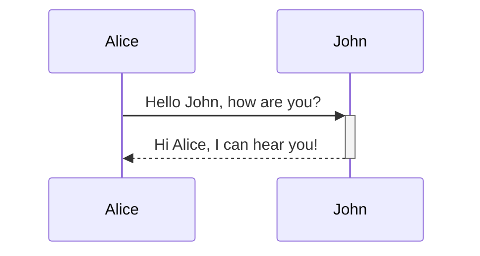

# Obsidian Flavored Markdown Skill

Create and edit valid Obsidian Flavored Markdown. Obsidian extends CommonMark and GitHub
Flavored Markdown (GFM) with wikilinks, embeds, callouts, properties, comments, block
references, and other syntax. This skill covers Obsidian-specific extensions — standard
Markdown (headings, bold, italic, lists, blockquotes, code blocks, tables) is assumed
knowledge.

## Quick Reference — Obsidian-Specific Syntax

### Properties (YAML Frontmatter)

Properties **must** be the very first thing in the file. Delimited by `---` on their own lines.

```yaml
---
title: My Note
date: 2024-01-15
tags:
  - project
  - active
aliases:
  - Alternative Name
  - Short Name
cssclasses:
  - wide-page
publish: true
---
```

**Default property keys recognized by Obsidian:**

- `tags` — searchable labels (list format, without `#` prefix)
- `aliases` — alternative note names that appear in link suggestions
- `cssclasses` — CSS classes applied to the note in reading/editing view
- `publish` — controls Obsidian Publish visibility (true/false)
- `permalink` — custom URL path for Obsidian Publish
- `description` — page description for Obsidian Publish SEO
- `image` / `cover` — social media preview image for Obsidian Publish

**Property types:** Text, List, Number, Checkbox, Date, Date & Time, Tags.

Internal links in text properties must be quoted: `link: "[[Episode IV]]"`

Properties can also be defined as JSON (read, interpreted, and saved as YAML):

```yaml
---
{
  "tags": ["journal"],
  "publish": false
}
---
```

See [PROPERTIES.md](references/PROPERTIES.md) for full type details, rules, and examples.

### Internal Links (Wikilinks)

Use `[[wikilinks]]` for notes within the vault. Obsidian tracks renames automatically.
Use `[text](url)` for external URLs only (spaces must be URL-encoded as `%20`).

```markdown
[[Note Name]]                        Link to note
[[Note Name.md]]                     With explicit extension
[[Note Name|Display Text]]           Custom display text
[[Note Name#Heading]]                Link to heading
[[Note Name#Heading#Subheading]]     Link to subheading
[[Note Name#^block-id]]              Link to block
[[#Heading in same note]]            Same-note heading link
[[##Search all headings]]            Vault-wide heading search
[[^^Search all blocks]]              Vault-wide block search
```

**Invalid characters in links:** `#`, `|`, `^`, `:`, `%%`, `[[`, `]]`

**Markdown format links** (when wikilinks disabled):

```markdown
[Display Text](Note%20Name.md)
[Display Text](Note%20Name.md#Heading)
[Note](obsidian://open?vault=MainVault&file=Note.md)
```

### Block References

Define a block ID by appending a space, `^`, and the identifier to a paragraph:

```markdown
This paragraph can be linked to. ^my-block-id
```

Block IDs can only contain: Latin letters, numbers, and dashes.

For **structured blocks** (lists, blockquotes, callouts, tables), place the block ID
on a separate line with a blank line before and after:

```markdown
- Item one
- Item two

^my-list-id

This is the next paragraph.
```

For **specific list items**, the block ID can go directly on the bullet:

```markdown
- Gemmy ^gemmy-id
- Unhelpful assistant
```

Then link to it: `[[Note Name#^my-block-id]]`

### Aliases

Aliases are alternative names for a note, defined in frontmatter:

```yaml
---
aliases:
  - AI
  - Artificial Intelligence
  - Machine Intelligence
---
```

When typing `[[`, aliases appear in suggestions with a curved arrow icon. Obsidian
creates links as `[[Full Note Name|AI]]` to ensure interoperability.

Use aliases when you want the same note to be findable by different names across
your vault. Use `|Display Text` when you want to customize a link in one specific place.

### Embeds

Prefix a link with `!` to embed content inline:

```markdown
![[Note Name]]                       Embed full note
![[Note Name#Heading]]               Embed section under heading
![[Note Name#^block-id]]             Embed specific block
![[image.png]]                       Embed image
![[image.png|300]]                   Image with width (px)
![[image.png|640x480]]               Image with width × height
![[document.pdf]]                    Embed PDF
![[document.pdf#page=3]]             Embed PDF at specific page
![[document.pdf#height=400]]         Embed PDF with custom viewer height
![[audio.mp3]]                       Embed audio player
![[video.mp4]]                       Embed video player
```

**External images with size:** ``

**YouTube videos** can be embedded with markdown image syntax:
``

**Tweets** can be embedded similarly:
``

**Embed search results** using a `query` code block:

````markdown
```query
tag:#project
```
````

See [EMBEDS.md](references/EMBEDS.md) for all embed types.

### Callouts

Callouts are styled blockquote blocks using `> [!type]` syntax:

```markdown
> [!note]
> Basic note callout.

> [!warning] Custom Title
> Callout with a custom title.

> [!tip] Title-only callout

> [!tip]- Collapsed by Default
> This content is hidden until expanded.

> [!info]+ Expanded but Collapsible
> Visible but can be collapsed.
```

**Foldable callouts:** Append `-` (collapsed) or `+` (expanded) directly after the type.

**Nesting:** Add extra `>` for each nesting level:

```markdown
> [!question] Can callouts be nested?
>> [!todo] Yes!, they can.
>>> [!example] You can even use multiple layers of nesting.
```

**Built-in callout types:**

| Type       | Aliases                    |
|------------|----------------------------|
| `note`     |                            |
| `abstract` | `summary`, `tldr`          |
| `info`     | `todo`                     |
| `tip`      | `hint`, `important`        |
| `success`  | `check`, `done`            |
| `question` | `help`, `faq`              |
| `warning`  | `caution`, `attention`     |
| `failure`  | `fail`, `missing`          |
| `danger`   | `error`                    |
| `bug`      |                            |
| `example`  |                            |
| `quote`    | `cite`                     |

Unsupported types default to `note` styling. Type identifiers are case-insensitive.

See [CALLOUTS.md](references/CALLOUTS.md) for custom CSS callouts and detailed usage.

### Tags

```markdown
#tag                                 Inline tag
#nested/tag                          Nested tag with hierarchy
#project/active                      Multi-level nesting
```

**Tag rules:**
- Must contain at least one non-numeric character (e.g., `#1984` is invalid, `#y1984` is valid)
- Can contain: letters, numbers, underscores `_`, hyphens `-`, forward slashes `/`
- Cannot contain: spaces or other special characters
- Tags are **case-insensitive**: `#Tag` and `#TAG` are treated as identical
- Can also be defined in frontmatter under `tags` (list format, without `#`)
- Nested tags: `tag:inbox` in search matches `#inbox` and all children like `#inbox/to-read`

### Comments

```markdown
This is visible %%but this is hidden%% text.

%%
This entire block is hidden in reading view.
Only visible in editing/source mode.
%%
```

HTML comments (`<!-- comment -->`) can be used as an alternative when exporting
via Pandoc, which has limited support for `%%` comments.

### Footnotes

```markdown
Text with a footnote[^1].

[^1]: This is the footnote content.
[^2]: Add 2 spaces at the start of each new line.
  This lets you write footnotes that span multiple lines.
[^note]: Named footnotes still appear as numbers.

Inline footnote.^[This is an inline footnote.]
```

Note: Inline footnotes only work in Reading view, not in Live Preview.

### Highlights

```markdown
This is ==highlighted text== in Obsidian.
```

### Math (LaTeX / MathJax)

```markdown
Inline math: $e^{2i\pi} = 1$

Block math:
$$
\begin{vmatrix}a & b\\
c & d
\end{vmatrix}=ad-bc
$$
```

### Diagrams (Mermaid)

````markdown

````

To link Mermaid nodes to Obsidian notes, add `class NodeName internal-link;`.
For special characters in note names, use double quotes: `class "⨳ special" internal-link`.

### Task Lists

```markdown
- [ ] Incomplete task
- [x] Completed task
- [ ] Task with [[wikilink]] and #tag
```

### Escaping Markdown

Use backslash `\` to display special characters literally:

```markdown
\*Not italic\*   \#Not a heading   \|Not a table pipe
1\. Not a list item (backslash before the period, not the number)
```

### Line Breaks

By default, a single `Enter` continues the same paragraph. To insert a line break:
- Add two spaces at end of line before `Enter`, or
- Use `Shift+Enter`

Enable **Strict line breaks** (Settings → Editor) for standard Markdown behavior.

### Nesting Code Blocks

When documenting code blocks inside other code blocks, use more backticks (or tildes)
for the outer block than the inner block, or mix backticks and tildes:

`````markdown
````md
```js
console.log("Hello")
```
````
`````

### HTML in Obsidian

Obsidian supports sanitized HTML. Key tags: `<u>`, `<sub>`, `<sup>`, `<s>`,
`<mark>`, `<span>`, `<div>`, `<details>`, `<summary>`, `<table>`, `<!-- -->`.

**Critical limitation:** Markdown inside HTML block elements does **not** render.
HTML blocks must be self-contained with no blank lines within them.

See [HTML.md](references/HTML.md) for full details and limitations.

### Embed Web Pages (iframe)

```html
<iframe src="https://example.com" width="100%" height="500"></iframe>
```

Not all websites allow embedding. YouTube and tweets can also be embedded using
markdown image syntax (see Embeds section above).

## Tables (Obsidian-Specific Notes)

Standard Markdown tables work. Obsidian additions:

- Escape `|` inside tables with `\|` (needed for aliases and image resizing)
- Align columns: `:--` left, `:--:` center, `--:` right
- In Live Preview, right-click tables to add/delete columns and rows
- Header row requires at least two hyphens per column

```markdown
[[Basic formatting\|Markdown syntax]] | ![[image.jpg\|200]]
```

## File and Vault Structure

### Accepted File Formats

Obsidian natively creates/edits: `.md`, `.base`, `.canvas` (JSON Canvas).

Files you can embed or link to within notes:

| Category  | Formats                                                      |
|-----------|--------------------------------------------------------------|
| Images    | `avif`, `bmp`, `gif`, `jpeg`, `jpg`, `png`, `svg`, `webp`   |
| Audio     | `flac`, `m4a`, `mp3`, `ogg`, `wav`, `webm`, `3gp`           |
| Video     | `mkv`, `mov`, `mp4`, `ogv`, `webm`                          |
| Documents | `pdf`                                                        |

Community plugins can extend support for additional file formats.

### Attachments

Attachments are non-Markdown files stored in the vault (images, PDFs, audio, etc.).

**Default location** (Settings → Files & Links → Default location for new attachments):

- **Vault folder** — root of the vault (default)
- **In the folder specified below** — a dedicated folder like `attachments/` or `media/`
- **Same folder as current file** — alongside the note
- **In subfolder under current folder** — e.g., `./assets/`

Drag-and-drop files into a note on desktop to auto-embed. On mobile, use attachment options.

### Configuration Folder

The `.obsidian/` folder stores vault-level settings:

- `app.json` — core settings
- `appearance.json` — theme and font settings
- `workspace.json` — layout and open files
- `plugins/` — installed community plugins
- `snippets/` — custom CSS snippet files (`.css`)
- `themes/` — installed themes

### CSS Snippets

Custom CSS files placed in `.obsidian/snippets/` can style callouts, properties,
and other vault elements. Enable them in Settings → Appearance → CSS Snippets.
Obsidian auto-detects changes — no restart needed.

```css
/* Example: Custom callout type */
.callout[data-callout="custom-type"] {
    --callout-color: 255, 100, 0;
    --callout-icon: lucide-alert-circle;
}
```

Obsidian uses Lucide icons (version 0.446.0). Browse at: https://lucide.dev/icons/

### Bases (Database Views)

Bases is a core plugin for creating database-like views of your notes. Bases use
`.base` files or can be embedded in notes via `base` code blocks. They support
table, list, card, and map views with filters, formulas, and sorting.

See [BASES.md](references/BASES.md) for syntax, formulas, functions, and examples.

## Key Principles

1. **Wikilinks over Markdown links** for internal vault notes — Obsidian tracks renames
2. **Frontmatter must be first** — no content, whitespace, or blank lines before `---`
3. **Block IDs** go at end of paragraph: `Some text. ^block-id`; for lists/quotes, on a separate line
4. **Embeds use `!`** prefix: `![[note]]` embeds, `[[note]]` links
5. **Tags in frontmatter** use list format without `#` prefix; tags are case-insensitive
6. **Callout syntax** — no space between `>` and `[!type]`; unsupported types default to `note`
7. **Aliases** in frontmatter enable finding notes by alternative names throughout the vault
8. **Comments** (`%%...%%`) are invisible in reading view — use for drafts/notes-to-self
9. **Internal links in properties** must be quoted: `link: "[[Note]]"`
10. **HTML blocks** must be self-contained — no blank lines within, no Markdown inside

## Additional Resources

- For complete property types and rules, see [PROPERTIES.md](references/PROPERTIES.md)
- For all embed types and iframe usage, see [EMBEDS.md](references/EMBEDS.md)
- For callout customization and CSS, see [CALLOUTS.md](references/CALLOUTS.md)
- For HTML tags, limitations, and styling, see [HTML.md](references/HTML.md)
- For Bases syntax, formulas, and functions, see [BASES.md](references/BASES.md)
- For example note templates, see [examples/](examples/)
