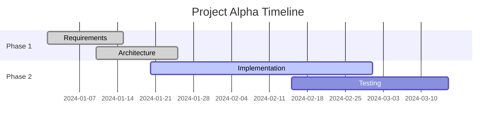
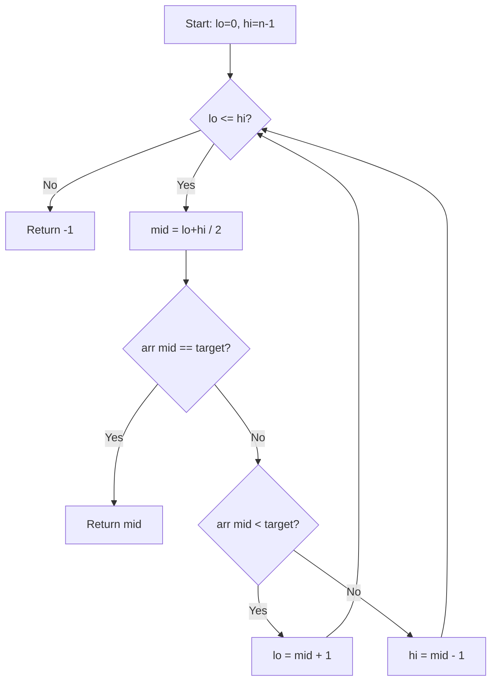

# Example Note Templates

## Daily Note

```markdown
---
date: 2024-03-15
tags:
  - daily
---

# 2024-03-15

## Tasks
- [ ] Review pull requests
- [ ] Update project documentation
- [x] Morning standup

## Notes
- Met with [[Sarah Chen]] about the [[API Migration]] timeline
- Key decision: switching to REST over GraphQL ^decision-api

## Journal
%%This section is private — hidden in reading view%%
Feeling productive today. The conversation with Sarah helped clarify scope.
%%
```

## Meeting Note

```markdown
---
title: Q1 Planning Meeting
date: 2024-01-10
tags:
  - meetings
  - quarterly
aliases:
  - Q1 Planning
  - January Planning Session
---

# Q1 Planning Meeting

**Attendees:** [[Alice Wang]], [[Bob Smith]], [[Carol Jones]]
**Date:** 2024-01-10

## Agenda
1. Review Q4 results
2. Set Q1 objectives
3. Resource allocation

## Decisions

> [!important] Key Decision
> We will prioritize the mobile app redesign over the admin dashboard.
> Timeline: 6 weeks starting January 15. ^q1-priority

## Action Items
- [ ] [[Alice Wang]] — Draft mobile app wireframes by Jan 17
- [ ] [[Bob Smith]] — Finalize API contracts by Jan 20
- [ ] [[Carol Jones]] — Update project board in [[Project Tracker]]

## Notes
- Budget approved for two additional contractors
- See ![[Q4 Results#Revenue Summary]] for context

[^1]: Follow-up meeting scheduled for January 24.
```

## Project MOC (Map of Content)

```markdown
---
title: Project Alpha
tags:
  - MOC
  - project/alpha
aliases:
  - Alpha Project
  - Project A
cssclasses:
  - wide-page
---

# Project Alpha

> [!abstract] Overview
> A cross-team initiative to modernize the authentication system.
> **Status:** In Progress | **Lead:** [[Jane Doe]] | **Sprint:** 4/8

## Key Documents
- [[Project Alpha — Requirements|Requirements]]
- [[Project Alpha — Architecture|Architecture]]
- [[Project Alpha — Timeline|Timeline]]

## Team
- [[Jane Doe]] — Project Lead
- [[Tom Lee]] — Backend
- [[Sara Kim]] — Frontend

## Decisions Log
- ![[Project Alpha — Architecture#Authentication Flow]]
- ![[Meeting 2024-01-10#^q1-priority]]

## Progress


## Related
- [[Authentication Best Practices]]
- [[OAuth 2.0 Notes]]
- [[Legacy Auth System]] %%deprecated — see migration plan%%
```

## Technical Note with Code and Math

```markdown
---
title: Binary Search Analysis
tags:
  - algorithms
  - computer-science
aliases:
  - Binary Search
---

# Binary Search Analysis

## Time Complexity

Binary search runs in $O(\log n)$ time. At each step, the search space
is halved, so for $n$ elements we need at most $\lceil \log_2 n \rceil$ comparisons.

$$
T(n) = T\left(\frac{n}{2}\right) + O(1) = O(\log n)
$$

## Implementation

```python
def binary_search(arr: list[int], target: int) -> int:
    lo, hi = 0, len(arr) - 1
    while lo <= hi:
        mid = (lo + hi) // 2
        if arr[mid] == target:
            return mid
        elif arr[mid] < target:
            lo = mid + 1
        else:
            hi = mid - 1
    return -1
```

> [!tip] Edge Case
> Always use `(lo + hi) // 2` in Python (no overflow). In languages like
> Java/C++, prefer `lo + (hi - lo) // 2` to avoid integer overflow. ^overflow-tip

## Visual Flow



## See Also
- [[Sorting Algorithms]]
- [[Data Structures — Arrays]]

[^1]: Knuth, *The Art of Computer Programming*, Vol. 3, §6.2.1.
```
